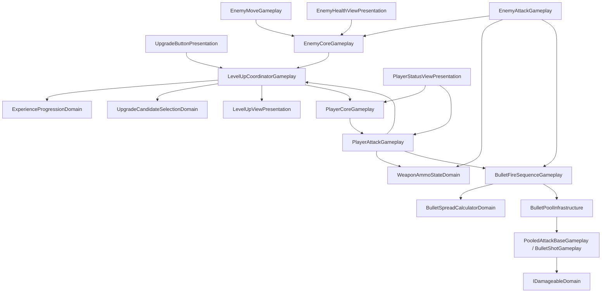

# ゲーム機能の責務・依存方向と拡張箇所

タグ: `現行仕様` `設計境界` `依存関係` `状態の所有者` `機能追加` `A-09`

- 照合日: 2026-10-04
- 照合版: `b7539d8`（A-08完了）。作業ツリーの既存変更はPackagesとUnityバージョン設定のみで、以下のゲームコードに差分はない。
- 対象: `Assets/Scripts/`、`Assets/Scenes/InGame.unity` と関連Prefab・設定アセット。
- 目的: 新しい強化・弾種・敵行動を追加する担当者が、状態の所有者、変更するコードと設定、確認する動作を辿れるようにする。

## 現在の設計

**ゲームルールの一部を純粋C#に分け、Unityコンポーネントが入力・物理・表示へ接続する構成**。責務を分ける軽量なレイヤード設計に、状態変更の通知（Observer）と弾の再利用（Object Pool）を組み合わせている。

ここで「所有者」は値を保持して変更結果を確定するクラス、「依存先」は直接呼ぶ、参照する、または生成する型を指す。以下はコード上の責務の区分であり、`Assets/Scripts/` にこれらを分離するasmdefはない。配置は既存のPlayer・Enemyフォルダーと共通ファイルを維持している。

| 区分 | 現在の実装 | 境界 |
| --- | --- | --- |
| 純粋C#のゲームルール | `ExperienceProgressionDomain`、`UpgradeCandidateSelectionDomain`、`WeaponAmmoStateDomain`、`BulletSpreadCalculatorDomain` | Unity型やコンポーネントを参照せず、値と乱数関数を受け取る |
| Unityとの接続・進行 | `LevelUpCoordinatorGameplay`、両攻撃コンポーネント、`BulletFireSequenceGameplay` | ルールを呼び、入力・非同期待機・Prefab配置・通知を扱う |
| 表示 | `LevelUpViewPresentation`、`PlayerStatusViewPresentation`、`EnemyHealthViewPresentation` | 確定した値を描画する。経験値・残弾・体力の確定を行わない |
| 設定 | `PlayerInitialStatsConfiguration`、`WeaponDefinitionConfiguration`、`BulletPrefabCatalogConfiguration` とInspectorの値 | 初期値と参照先を定義する。強化結果や残弾を共有アセットへ書き戻さない |
| Unity側に残るゲームルール | 両Coreの体力・死亡、Player側の強化計算、敵の行動判断、弾の命中判断 | A-10〜A-13の追加候補。純粋C#への移行は未採用 |

### 直接呼ぶ依存の方向

矢印は呼び出し元から依存先へ向ける。UIへ結果を渡す向きと、UIが状態を読む向きの両方がある。純粋C#の4クラスはこの図のUnityコンポーネントへ依存しない。

プレイヤー攻撃はメニュー状態を読むため `LevelUpCoordinatorGameplay` にも依存し、敵の移動・攻撃は `EnemyCoreGameplay` を介して対象・射程・レイヤーを読む。設定アセット・Unity APIなど図に省略した参照と、具体的な取得先は [必須参照の一覧](component-dependencies.md) を参照する。

## 機能ごとの状態・設定・Unity操作

| 機能 | 実行時状態の所有者 | 設定値・依存先 | Unity固有処理と関連コード |
| --- | --- | --- | --- |
| 経験値・レベル | `ExperienceProgressionDomain` が経験値、レベル、強化選択回数を保持。`LevelUpCoordinatorGameplay` が撃破数・メニュー開閉を保持 | Managerの必要経験値リストをProgressionが起動時に複製 | [Manager](../../Assets/Scripts/Progression/Gameplay/LevelUpCoordinatorGameplay.cs) の `GainExperience()` が敵から値を受け、[Progression](../../Assets/Scripts/Progression/Domain/ExperienceProgressionDomain.cs) の結果を [View](../../Assets/Scripts/Progression/Presentation/LevelUpViewPresentation.cs) に渡す |
| 強化候補 | `UpgradeCandidateSelectionDomain` が再抽選トークンを保持。Managerが候補ID一覧、Viewがボタン配列と表示を保持 | ボタン配列の添字を候補IDにする。乱数はManagerから `UnityEngine.Random.Range` を渡す | [Selection](../../Assets/Scripts/Progression/Domain/UpgradeCandidateSelectionDomain.cs) が重複のない3件を返し、Viewがボタンを表示・並べ替える。Viewに抽選・残高判定を置かない |
| プレイヤー能力値・強化 | `PlayerCoreGameplay` が体力・最大体力、`PlayerMoveGameplay` が速度、`PlayerAttackGameplay` が武器値を保持 | [初期能力値](../../Assets/Scripts/Player/Configuration/PlayerInitialStatsConfiguration.cs)、[武器定義](../../Assets/Scripts/Combat/Configuration/WeaponDefinitionConfiguration.cs) をAwakeで複製。ボタンの [UpgradeParametersConfiguration](../../Assets/Scripts/Progression/Configuration/UpgradeParametersConfiguration.cs) は値型の強化設定 | [Core](../../Assets/Scripts/Player/Gameplay/PlayerCoreGameplay.cs) の `ApplyPowerUp()` が体力と速度を更新し、[Attack](../../Assets/Scripts/Player/Gameplay/PlayerAttackGameplay.cs) に武器の変更を渡す。整数化・加算乗算順はここに残る |
| 射撃・待機 | 各攻撃コンポーネントが個別に作る [WeaponAmmoStateDomain](../../Assets/Scripts/Combat/Domain/WeaponAmmoStateDomain.cs) が装弾数・残弾・待機種類・射撃可否を保持 | 武器定義の装弾数、同時発射数、拡散角、待機時間、弾パラメーター | PlayerAttackは入力、[EnemyAttackGameplay](../../Assets/Scripts/Enemy/Gameplay/EnemyAttackGameplay.cs) は物理判定を受ける。両者がUniTaskで時間を待ち、キャンセル後の再開始を担当。PlayerAttackはUI復元用の待機時間も保持 |
| 拡散・弾の発射 | [BulletSpreadCalculatorDomain](../../Assets/Scripts/Combat/Domain/BulletSpreadCalculatorDomain.cs) は状態を持たない計算。[BulletFireSequenceGameplay](../../Assets/Scripts/Combat/Gameplay/BulletFireSequenceGameplay.cs) が発射成功後にAmmoの残弾を消費 | 攻撃側から同時発射数、拡散角、残弾、発射口、弾種、`BulletParametersConfiguration` を渡す | 角度計算の結果をQuaternionで向きへ変換し、プール取得→パラメーターと配置→発射時初期化→残弾消費の順で実行 |
| 弾の再利用・命中 | [PoolManager](../../Assets/Scripts/Combat/Infrastructure/BulletPoolInfrastructure.cs) が種類別のプール、[BulletShotGameplay](../../Assets/Scripts/Combat/Gameplay/BulletShotGameplay.cs) が取得ごとの命中回数と寿命待機を保持 | [弾種列挙](../../Assets/Scripts/Combat/Domain/BulletTypeDomain.cs)、[対応データベース](../../Assets/Scripts/Combat/Configuration/BulletPrefabCatalogConfiguration.cs)、Prefab、AudioSource | 生成時に [PooledAttackBaseGameplay](../../Assets/Scripts/Combat/Gameplay/PooledAttackBaseGameplay.cs) を初期化。発射時に速度・音・寿命・命中回数を設定。衝突時に [IDamageableDomain](../../Assets/Scripts/Combat/Contracts/IDamageableDomain.cs) を呼び、演出を生成し、反射上限・寿命で返却 |
| 敵の体力・行動 | [EnemyCoreGameplay](../../Assets/Scripts/Enemy/Gameplay/EnemyCoreGameplay.cs) が体力、対象、射程、レイヤーを保持。[EnemyMoveGameplay](../../Assets/Scripts/Enemy/Gameplay/EnemyMoveGameplay.cs) が感知結果を保持 | Coreの最大体力・撃破経験値・射程、Moveの感知範囲、Attackの武器設定。PlayerCoreGameplay、レベル管理、弾プールへ依存 | Physicsで感知・射線を判断し、NavMeshAgentで追跡・停止、Transformで旋回する。移動と攻撃の条件判断はそれぞれのUpdateに残る |
| 体力・弾数の表示 | 状態の所有者はCoreとAttack。UIは参照先と初期化済みフラグだけを保持 | [PlayerStatusViewPresentation](../../Assets/Scripts/Player/Presentation/PlayerStatusViewPresentation.cs)、[EnemyHealthViewPresentation](../../Assets/Scripts/Enemy/Presentation/EnemyHealthViewPresentation.cs) のImage・文字参照 | 変更通知を受けて描画し、再有効化時は現在値を読み直す。待機バーのTweenは表示専用 |

`BulletParametersConfiguration` は値型として個体・弾へコピーするが、Unityの属性と `Mathf` を使用するため純粋C#には含めない。武器定義を変更しても、既にAwakeで複製済みの武器値へ自動反映する仕組みはない。

## 呼び出し・通知と寿命

| 発生元 → 受け手 | 入口・通知 | 確定順と登録期間 |
| --- | --- | --- |
| `EnemyCoreGameplay` → Manager | 非公開の `OnDeath` から `GainExperience()` | 敵Startで接続。死亡時に経験値・撃破数・トークンを更新し、Viewへ渡す。再有効化のたびに登録するUI購読とは別の、敵生成時の接続 |
| 強化ボタン → Manager → PlayerCoreGameplay | `Upgrade()` → `TrySpendUpgradeChoice()` → `ApplyPowerUp()` | 選択回数の消費成功後に適用し、候補を再抽選。ボタン設定とクリック接続は [UpgradeButton prefab](../../Assets/Prefab/UpgradeButton.prefab) を参照 |
| 再抽選・メニューボタン → Manager | `TryReroll()`、`OpenCloseUpgradeMenu()` | [InGame](../../Assets/Scenes/InGame.unity) のButton.onClickから呼ぶ。再抽選は候補決定成功後にトークンを消費 |
| Manager → `LevelUpViewPresentation` | `ShowProgress()`、`ShowCandidates()` などの直接呼び出し | Managerが結果を確定してから表示。経験値バーはOnDisableでTweenを停止し、最後の確定値へ合わせる |
| 両Core → 体力UI | `OnHealthChanged` | Health更新後に通知。UIは初回Start、以後OnEnableで登録し、OnDisableで解除。Coreの `OnDied` はInspectorから接続できる別のUnityEvent |
| PlayerAttackGameplay → プレイヤーUI | `OnAmmoCountChanged`、`OnReloadBegin`、`OnCoolDownBegin` | 発射ごとの残弾変更、再装填完了、強化などを通知。待機状態・時間を確定してから開始通知。UIは体力と同じ期間で購読 |
| 弾 → PoolManager | `OnReturnToPool` | 弾生成時に1回接続し、再利用ごとに登録し直さない。発射時の寿命待機は返却によるOnDisableでキャンセル |

CoreとPlayerAttackの通知は現状 `Action` フィールド、弾の返却通知は `Action` プロパティであり、C#の `event` キーワードで公開範囲を制限してはいない。新しい表示を追加する場合も、購読先と解除時点を明示する。UIの初期化順と待機バー復元の詳細は [体力・弾数UIの購読期間](player-stats-and-upgrades.md#体力弾数uiの購読期間) を参照する。

## 機能追加時の変更箇所と確認

### 新しい強化を追加する

1. 既存の能力値を調整する強化なら、UpgradeButton prefabを使用した候補ボタンの `UpgradeParametersConfiguration`、表示文字、Button.onClickを設定する。候補元はViewの `_buttonLayoutGroup` 配下のButtonで、非表示のボタンも初期取得対象になる。現在の候補IDは取得時の配列添字で、永続化用IDではない。
2. 新しい能力値なら `UpgradeParametersConfiguration` と状態の所有者に追加し、`PlayerCoreGameplay.ApplyPowerUp()` または `PlayerAttackGameplay.ApplyPowerUp()` へ適用を実装する。初期値が必要なら対応するScriptableObjectと使用者のAwakeコピーも更新する。メニューの途中で候補を動的追加する仕組みは現在なく、起動時の候補一覧を使う。
3. 抽選の件数・コストを変える場合はSelectionを変更する。表示だけの変更はViewに置く。強化対象の結果や残高はUIに確定させない。
4. 確認: 選択回数0で適用されないこと、候補3件の重複防止、再抽選失敗時の残高、連続強化の加算・乗算・整数化、装弾数変更時の補充、共有設定・別個体への影響、UIとの一致。強化結果の詳細は [能力値の現行仕様](player-stats-and-upgrades.md) を更新する。

### 新しい弾種を追加する

1. `BulletTypeDomain` に既存の数値を変えず種類を追加し、[対応アセット](../../Assets/Scripts/ScriptableObject/BulletPrefabCatalogConfiguration.asset) のMappingsに1種類につき1件のPrefabを設定する。プールはStartでこの対応表から生成される。
2. PrefabにPooledAttackBaseを継承する部品を配置し、生成時の `OnInitialize()` と発射ごとの `OnGetFromPool()` を実装する。後者では再利用時に残る状態をリセットし、無効化時には時間待機を中断する。音の自動注入は現在BulletShotBehaviourへの型判定なので、別の派生型で音を使うなら注入経路も変更する。
3. 発射元が `BulletFireSequenceGameplay.Fire()` へ新しい種類を渡すように変更する。現在はPlayerAttack・EnemyAttackがそれぞれPlayerBullet・EnemyBulletを直接指定しており、WeaponDefinitionに弾種の選択項目はない。Inspectorで選びたい場合は定義・コピー・発射引数まで追加する。
4. 確認: 種類とPrefabの対応、単発・複数発・残弾不足時の角度と消費、配置後の初期速度、命中とダメージ、寿命・反射回数による返却、再取得時のリセット、音とエフェクト、Play停止・再開。弾プールと命中処理はUnityで確認する。

### 新しい敵の行動を追加する

1. [Enemy prefab](../../Assets/Prefab/Enemy.prefab) と [派生敵](<../../Assets/Prefab/Enemy Type Beta.prefab>) を起点に、EnemyCoreの体力・射程・経験値、EnemyMoveの感知範囲、EnemyAttackの武器定義・発射口を設定する。Core・移動・攻撃・UIの配置と必須参照を保つ。
2. 追跡・停止・旋回を変えるならEnemyMove、射撃条件を変えるならEnemyAttackを変更する。複数の行動段階が必要なら、判定結果を入力として選択を計算する純粋C#クラスを設ける案（A-12）を検討する。その場合もPhysics・NavMeshAgentの実行はUnity側に置く。
3. 確認: 感知・射程の境界、遮蔽物の有無、対象レイヤー、追跡と停止、射撃・待機・無効化後の再開、撃破経験値と体力UI、派生Prefabと設定共有の独立性。行動条件を変えたら現行仕様へ追記する。

## 検証証拠と文書の更新

- A-01〜A-08の実行結果は [能力値と強化の確認状況](player-stats-and-upgrades.md#確認状況) に記録済み。純粋C#の境界値確認やA-01〜A-07の一部は当時の一時検証であり、継続利用するテストが全機能に揃っている状態ではない。
- 継続利用する [UiEventLifetimeTests](../../Assets/Editor/UiEventLifetimeTests.cs) は、Test RunnerのEdit ModeからPlayへ移行して体力・弾数UIの初期値、購読数、無効化・再表示、待機バー復元、UI破棄後の解除を確認する。新しいUIや通知を追加した場合は関連するケースを更新する。
- A-09は文書変更のみ。2026-10-04に関連クラス・呼び出し・設定の対応を静的照合し、相対リンクの参照先、純粋C#の4クラスの依存、差分の整合性を確認した。以前の実行結果を再実行した扱いにはしない。D-01〜D-09の残る再生確認は [設計レビューのタスク](../tasks/program-design-review.md) で管理する。
- 今後の実装では、この文書の状態所有者・依存・通知期間・拡張手順と、該当する機能仕様を更新する。設計方針自体を変えた場合は [目標設計](../knowledge/target-architecture.md) に判断理由を追記し、実行した検証と残る確認をタスク記録へ結び付ける。
